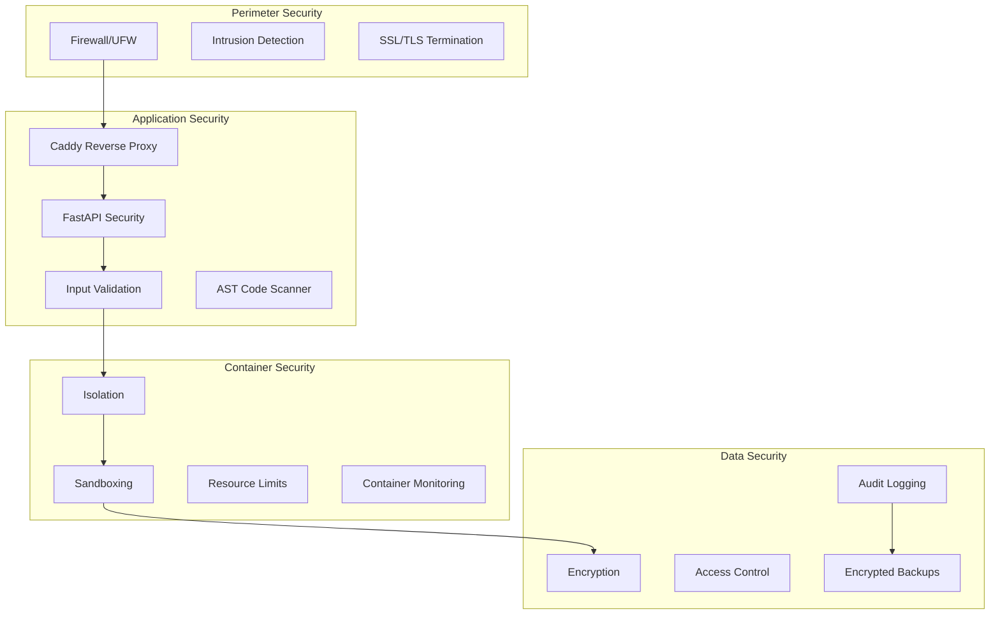

# Bezpečnostní a monitorovací protokol Longin EGO System

## 1. Bezpečnostní architektura

### 1.1 Vrstvy zabezpečení



### 1.2 Container Security Model

**Sibling Container Isolation:**
```yaml
# Docker security configuration
security_opt:
  - no-new-privileges:true
  - apparmor:docker-default
  
cap_drop:
  - ALL
  
cap_add:
  - CHOWN
  - SETGID
  - SETUID
  
read_only: true
  
tmpfs:
  - /tmp:noexec,nosuid,size=100m
  - /var/run:size=100m
```

**Resource Constraints:**
```yaml
# Memory and CPU limits
mem_limit: 512m
memswap_limit: 512m
  
cpu_quota: 50000  # 50% of one CPU
cpu_period: 100000
  
pids_limit: 100
```

### 1.3 Network Security

**Docker Network Isolation:**
```bash
# Create isolated network
docker network create --driver bridge \
  --subnet 172.20.0.0/16 \
  --gateway 172.20.0.1 \
  --internal=false \
  --attachable=false \
  longin-net
```

**Firewall Rules (UFW):**
```bash
# Default policies
sudo ufw default deny incoming
sudo ufw default allow outgoing

# SSH access
sudo ufw allow from [ADMIN_IP] to any port 22

# Web traffic
sudo ufw allow 80/tcp
sudo ufw allow 443/tcp

# Rate limiting
sudo ufw limit 22/tcp
```

### 1.4 Application Security

**FastAPI Security Headers:**
```python
from fastapi import FastAPI
from fastapi.middleware.cors import CORSMiddleware
from fastapi.middleware.trustedhost import TrustedHostMiddleware

app = FastAPI()

# CORS configuration
app.add_middleware(
    CORSMiddleware,
    allow_origins=["https://www.longinegosystem.eu"],
    allow_credentials=True,
    allow_methods=["GET", "POST"],
    allow_headers=["*"],
    max_age=3600,
)

# Security headers
@app.middleware("http")
async def add_security_headers(request, call_next):
    response = await call_next(request)
    response.headers["X-Content-Type-Options"] = "nosniff"
    response.headers["X-Frame-Options"] = "DENY"
    response.headers["X-XSS-Protection"] = "1; mode=block"
    response.headers["Strict-Transport-Security"] = "max-age=31536000; includeSubDomains"
    response.headers["Referrer-Policy"] = "strict-origin-when-cross-origin"
    return response
```

**Input Validation:**
```python
from pydantic import BaseModel, Field, validator

class SpawnRequest(BaseModel):
    command: str = Field(..., min_length=1, max_length=10000)
    sandbox_mode: bool = True
    env_vars: Dict[str, str] = Field(default_factory=dict)
    
    @validator('command')
    def validate_command(cls, v):
        # AST validation
        import ast
        try:
            tree = ast.parse(v)
            # Additional security checks
            for node in ast.walk(tree):
                if isinstance(node, ast.Import):
                    for alias in node.names:
                        if alias.name in FORBIDDEN_IMPORTS:
                            raise ValueError(f"Forbidden import: {alias.name}")
                elif isinstance(node, ast.ImportFrom):
                    if node.module in FORBIDDEN_MODULES:
                        raise ValueError(f"Forbidden module: {node.module}")
        except SyntaxError as e:
            raise ValueError(f"Invalid Python syntax: {e}")
        return v
```

## 2. Code Security Scanning

### 2.1 AST Security Scanner

**Forbidden Imports:**
```python
FORBIDDEN_IMPORTS = [
    'os', 'sys', 'subprocess', 'socket', 'requests',
    'urllib', 'ftplib', 'smtplib', 'http.client',
    'xml.etree.ElementTree', 'pickle', 'marshal',
    'ctypes', 'ctypes.wintypes', 'mmap'
]

FORBIDDEN_MODULES = [
    'os', 'sys', 'subprocess', 'socket', 'signal',
    'multiprocessing', 'threading', 'asyncio.subprocess'
]
```

**Security Scanning Implementation:**
```python
import ast
import logging

class SecurityScanner(ast.NodeVisitor):
    def __init__(self):
        self.violations = []
        
    def visit_Import(self, node):
        for alias in node.names:
            if alias.name in FORBIDDEN_IMPORTS:
                self.violations.append(f"Forbidden import: {alias.name}")
        self.generic_visit(node)
        
    def visit_ImportFrom(self, node):
        if node.module in FORBIDDEN_MODULES:
            self.violations.append(f"Forbidden module: {node.module}")
        self.generic_visit(node)
        
    def visit_Call(self, node):
        # Check for dangerous function calls
        if isinstance(node.func, ast.Name):
            if node.func.id in ['eval', 'exec', 'compile', '__import__']:
                self.violations.append(f"Dangerous function call: {node.func.id}")
        self.generic_visit(node)

def scan_code_security(code: str) -> List[str]:
    try:
        tree = ast.parse(code)
        scanner = SecurityScanner()
        scanner.visit(tree)
        return scanner.violations
    except SyntaxError as e:
        return [f"Syntax error: {e}"]
```

### 2.2 Container Vulnerability Scanning

**Trivy Integration:**
```bash
#!/bin/bash
# scan-containers.sh

IMAGES=(
    "longin-ego/ganglion:latest"
    "longin-ego/cortex:latest"
    "redis:7.2-alpine"
    "pgvector/pgvector:pg16"
    "caddy:2.9.1"
)

for image in "${IMAGES[@]}"; do
    echo "Scanning $image..."
    docker run --rm -v /var/run/docker.sock:/var/run/docker.sock \
        aquasec/trivy:latest image \
        --severity HIGH,CRITICAL \
        --exit-code 1 \
        "$image"
    
    if [ $? -ne 0 ]; then
        echo "Vulnerabilities found in $image"
        exit 1
    fi
done
```

## 3. Monitoring & Alerting

### 3.1 System Monitoring (Netdata)

**Installation:**
```bash
# Install Netdata
curl -sSL https://get.netdata.cloud | bash

# Configure for Docker
docker run -d --name=netdata \
  --pid=host \
  --network=longin-net \
  -v netdataconfig:/etc/netdata \
  -v netdatalib:/var/lib/netdata \
  -v netdatacache:/var/cache/netdata \
  -v /etc/passwd:/host/etc/passwd:ro \
  -v /etc/group:/host/etc/group:ro \
  -v /proc:/host/proc:ro \
  -v /sys:/host/sys:ro \
  -v /etc/os-release:/host/etc/os-release:ro \
  -p 19999:19999 \
  --restart unless-stopped \
  netdata/netdata
```

**Custom Alerts:**
```yaml
# /etc/netdata/health.d/longin.conf

# CPU usage alert
template: cpu_usage_high
      on: system.cpu
  lookup: average -3m unaligned of user,system,softirq,irq,guest
   units: %
   every: 10s
    warn: $this > 80
    crit: $this > 95
   delay: down 15m multiplier 1.5 max 1h
    info: CPU utilization is high
      to: sysadmin

# Memory usage alert
template: ram_usage_high
      on: system.ram
  lookup: average -3m unaligned
   units: %
   every: 10s
    warn: $this > 85
    crit: $this > 95
   delay: down 15m multiplier 1.5 max 1h
    info: RAM utilization is high
      to: sysadmin

# Disk space alert
template: disk_space_usage
      on: disk.space
  lookup: average -3m unaligned
   units: %
   every: 10s
    warn: $this > 80
    crit: $this > 90
   delay: down 15m multiplier 1.5 max 1h
    info: Disk space utilization is high
      to: sysadmin
```

### 3.2 Application Monitoring

**Custom Metrics Collection:**
```python
# metrics_collector.py
import time
import psutil
import redis
import psycopg2
from prometheus_client import Counter, Histogram, Gauge, start_http_server

# Define metrics
request_count = Counter('longin_requests_total', 'Total requests')
request_duration = Histogram('longin_request_duration_seconds', 'Request duration')
active_tasks = Gauge('longin_active_tasks', 'Number of active tasks')
memory_usage = Gauge('longin_memory_usage_bytes', 'Memory usage')
gpu_usage = Gauge('longin_gpu_usage_percent', 'GPU usage')

def collect_system_metrics():
    # Memory metrics
    memory = psutil.virtual_memory()
    memory_usage.set(memory.used)
    
    # CPU metrics
    cpu_percent = psutil.cpu_percent(interval=1)
    
    # Disk metrics
    disk = psutil.disk_usage('/')
    
    # GPU metrics (if available)
    try:
        import pynvml
        pynvml.nvmlInit()
        handle = pynvml.nvmlDeviceGetHandleByIndex(0)
        gpu_util = pynvml.nvmlDeviceGetUtilizationRates(handle)
        gpu_usage.set(gpu_util.gpu)
    except:
        pass

def collect_redis_metrics():
    try:
        r = redis.Redis(host='redis', port=6379, db=0)
        info = r.info()
        
        # Memory usage
        redis_memory = info.get('used_memory_rss', 0)
        
        # Connected clients
        connected_clients = info.get('connected_clients', 0)
        
        # Commands processed
        commands_processed = info.get('total_commands_processed', 0)
        
    except Exception as e:
        print(f"Redis metrics error: {e}")

def collect_postgres_metrics():
    try:
        conn = psycopg2.connect(
            host='postgres',
            database='longin_ego',
            user='longin',
            password='[PASSWORD]'
        )
        
        with conn.cursor() as cur:
            # Active connections
            cur.execute("SELECT count(*) FROM pg_stat_activity WHERE state = 'active';")
            active_connections = cur.fetchone()[0]
            
            # Database size
            cur.execute("SELECT pg_database_size('longin_ego');")
            db_size = cur.fetchone()[0]
            
            # Slow queries
            cur.execute("""
                SELECT count(*) FROM pg_stat_activity 
                WHERE state = 'active' AND now() - query_start > interval '1 second';
            """)
            slow_queries = cur.fetchone()[0]
            
    except Exception as e:
        print(f"PostgreSQL metrics error: {e}")
    finally:
        conn.close()

if __name__ == '__main__':
    # Start Prometheus metrics server
    start_http_server(8001)
    
    while True:
        collect_system_metrics()
        collect_redis_metrics()
        collect_postgres_metrics()
        time.sleep(15)  # 15-second interval
```

### 3.3 Health Check Endpoints

**Ganglion API Health Check:**
```python
# health_check.py
from fastapi import APIRouter, Depends, HTTPException
from pydantic import BaseModel
import redis
import psycopg2
from typing import Dict, Any

router = APIRouter()

class HealthResponse(BaseModel):
    status: str
    timestamp: str
    version: str
    checks: Dict[str, Any]

@router.get("/v1/health")
async def health_check():
    checks = {}
    overall_status = "ok"
    
    # Redis check
    try:
        r = redis.Redis(host='redis', port=6379, db=0)
        r.ping()
        checks["redis"] = {"status": "ok", "latency_ms": 1}
    except Exception as e:
        checks["redis"] = {"status": "error", "message": str(e)}
        overall_status = "error"
    
    # PostgreSQL check
    try:
        conn = psycopg2.connect(
            host='postgres',
            database='longin_ego',
            user='longin',
            password='[PASSWORD]'
        )
        with conn.cursor() as cur:
            cur.execute("SELECT 1")
            cur.fetchone()
        checks["postgres"] = {"status": "ok", "latency_ms": 2}
    except Exception as e:
        checks["postgres"] = {"status": "error", "message": str(e)}
        overall_status = "error"
    
    # System resources check
    try:
        import psutil
        memory_percent = psutil.virtual_memory().percent
        cpu_percent = psutil.cpu_percent(interval=1)
        
        if memory_percent > 90:
            checks["memory"] = {"status": "warning", "usage_percent": memory_percent}
        elif memory_percent > 95:
            checks["memory"] = {"status": "error", "usage_percent": memory_percent}
            overall_status = "error"
        else:
            checks["memory"] = {"status": "ok", "usage_percent": memory_percent}
            
        if cpu_percent > 90:
            checks["cpu"] = {"status": "warning", "usage_percent": cpu_percent}
        elif cpu_percent > 95:
            checks["cpu"] = {"status": "error", "usage_percent": cpu_percent}
            overall_status = "error"
        else:
            checks["cpu"] = {"status": "ok", "usage_percent": cpu_percent}
            
    except Exception as e:
        checks["system"] = {"status": "error", "message": str(e)}
    
    return HealthResponse(
        status=overall_status,
        timestamp=datetime.utcnow().isoformat(),
        version="1.0.0",
        checks=checks
    )

@router.get("/v1/ready")
async def readiness_check():
    # More comprehensive check including dependencies
    health = await health_check()
    
    # Additional checks for readiness
    if health.status != "ok":
        raise HTTPException(status_code=503, detail="Service not ready")
    
    # Check if system is ready to accept traffic
    return {"status": "ready", "timestamp": datetime.utcnow().isoformat()}
```

## 4. Incident Response

### 4.1 Incident Classification

**Severity Levels:**
- **Critical (P1)**: System down, data loss, security breach
- **High (P2)**: Major functionality impaired
- **Medium (P3)**: Minor functionality impaired
- **Low (P4)**: Cosmetic issues, enhancement requests

**Response Times:**
- **P1**: 15 minutes response, 2 hours resolution
- **P2**: 1 hour response, 8 hours resolution
- **P3**: 4 hours response, 24 hours resolution
- **P4**: 24 hours response, 72 hours resolution

### 4.2 Emergency Procedures

**Security Incident Response:**
```bash
#!/bin/bash
# emergency-response.sh

echo "EMERGENCY RESPONSE INITIATED"

# 1. Isolate affected containers
echo "Isolating containers..."
docker stop $(docker ps -q --filter "label=longin-ego")

# 2. Block suspicious IPs
echo "Blocking suspicious IPs..."
sudo ufw deny from [SUSPICIOUS_IP]

# 3. Preserve logs
echo "Preserving logs..."
docker logs --since 24h $(docker ps -aq) > /var/log/emergency_$(date +%Y%m%d_%H%M%S).log

# 4. Notify administrators
echo "Sending alerts..."
curl -X POST https://api.telegram.org/bot[BOT_TOKEN]/sendMessage \
  -d chat_id=[CHAT_ID] \
  -d text="SECURITY INCIDENT: Longin EGO System compromised"

# 5. Start clean containers
echo "Starting clean containers..."
docker system prune -f
docker compose -f docker-compose.release.yml up -d

echo "Emergency response completed"
```

### 4.3 Recovery Procedures

**System Recovery:**
```bash
#!/bin/bash
# system-recovery.sh

BACKUP_DATE="$1"
if [ -z "$BACKUP_DATE" ]; then
    echo "Usage: $0 <backup_date>"
    exit 1
fi

echo "SYSTEM RECOVERY INITIATED - Backup: $BACKUP_DATE"

# 1. Stop all services
echo "Stopping services..."
docker compose -f docker-compose.release.yml down

# 2. Restore database
echo "Restoring database..."
gpg --decrypt /backup/postgres_$BACKUP_DATE.sql.gz.gpg | \
  gunzip | \
  docker exec -i longin-ego-postgres-1 psql -U longin -d longin_ego

# 3. Restore Redis
echo "Restoring Redis..."
gpg --decrypt /backup/redis_$BACKUP_DATE.rdb.gpg > /tmp/redis_backup.rdb
docker cp /tmp/redis_backup.rdb longin-ego-redis-1:/data/dump.rdb
docker exec longin-ego-redis-1 redis-cli CONFIG SET dir /data
docker exec longin-ego-redis-1 redis-cli CONFIG SET dbfilename dump.rdb

# 4. Restart services
echo "Restarting services..."
docker compose -f docker-compose.release.yml up -d

# 5. Verify recovery
echo "Verifying recovery..."
sleep 30
curl -f http://localhost:8000/v1/health || exit 1
curl -f http://localhost:3000 || exit 1

echo "System recovery completed successfully"
```

## 5. Compliance & Audit

### 5.1 Audit Logging

**Comprehensive Audit System:**
```python
# audit_logger.py
import logging
import json
from datetime import datetime
from typing import Dict, Any
import psycopg2

class AuditLogger:
    def __init__(self, db_config: Dict[str, str]):
        self.db_config = db_config
        self.logger = logging.getLogger('audit')
        
    def log_event(self, event_type: str, user_id: str, details: Dict[str, Any]):
        """Log security and system events"""
        audit_entry = {
            'timestamp': datetime.utcnow().isoformat(),
            'event_type': event_type,
            'user_id': user_id,
            'details': details,
            'ip_address': details.get('ip_address'),
            'user_agent': details.get('user_agent')
        }
        
        # Log to file
        self.logger.info(json.dumps(audit_entry))
        
        # Log to database
        try:
            conn = psycopg2.connect(**self.db_config)
            with conn.cursor() as cur:
                cur.execute("""
                    INSERT INTO audit_log (timestamp, event_type, user_id, details)
                    VALUES (%s, %s, %s, %s)
                """, (
                    audit_entry['timestamp'],
                    audit_entry['event_type'],
                    audit_entry['user_id'],
                    json.dumps(audit_entry['details'])
                ))
            conn.commit()
        except Exception as e:
            self.logger.error(f"Failed to write audit log: {e}")
        finally:
            if conn:
                conn.close()

# Event types
SECURITY_EVENTS = [
    'LOGIN_SUCCESS', 'LOGIN_FAILURE', 'LOGOUT',
    'CODE_EXECUTION', 'SANDBOX_VIOLATION', 'CONTAINER_SPAWN',
    'CONFIG_CHANGE', 'USER_CREATED', 'USER_DELETED',
    'PERMISSION_GRANTED', 'PERMISSION_REVOKED',
    'SECURITY_SCAN_FAILED', 'VULNERABILITY_DETECTED'
]
```

### 5.2 Compliance Reporting

**Monthly Security Report:**
```python
# compliance_report.py
import psycopg2
from datetime import datetime, timedelta
import pandas as pd

class ComplianceReporter:
    def __init__(self, db_config: Dict[str, str]):
        self.db_config = db_config
    
    def generate_monthly_report(self, month: str) -> Dict[str, Any]:
        """Generate monthly compliance report"""
        
        start_date = f"{month}-01"
        end_date = (datetime.strptime(start_date, "%Y-%m-%d") + 
                   timedelta(days=32)).replace(day=1).strftime("%Y-%m-%d")
        
        conn = psycopg2.connect(**self.db_config)
        
        # Security events summary
        security_events = pd.read_sql("""
            SELECT event_type, COUNT(*) as count
            FROM audit_log 
            WHERE timestamp >= %s AND timestamp < %s
            AND event_type LIKE ANY(%s)
            GROUP BY event_type
        """, conn, params=[start_date, end_date, SECURITY_EVENTS])
        
        # Failed login attempts
        failed_logins = pd.read_sql("""
            SELECT COUNT(*) as count
            FROM audit_log 
            WHERE timestamp >= %s AND timestamp < %s
            AND event_type = 'LOGIN_FAILURE'
        """, conn, params=[start_date, end_date])
        
        # Code execution summary
        code_executions = pd.read_sql("""
            SELECT COUNT(*) as total,
                   COUNT(CASE WHEN details->>'sandbox_mode' = 'true' THEN 1 END) as sandboxed,
                   COUNT(CASE WHEN details->>'security_violation' = 'true' THEN 1 END) as violations
            FROM audit_log 
            WHERE timestamp >= %s AND timestamp < %s
            AND event_type = 'CODE_EXECUTION'
        """, conn, params=[start_date, end_date])
        
        # System availability
        uptime = self.calculate_uptime(start_date, end_date)
        
        return {
            'period': month,
            'generated_at': datetime.utcnow().isoformat(),
            'security_events': security_events.to_dict('records'),
            'failed_logins': failed_logins.iloc[0]['count'],
            'code_executions': code_executions.to_dict('records')[0],
            'uptime_percentage': uptime,
            'compliance_status': 'COMPLIANT' if self.check_compliance(security_events) else 'NON-COMPLIANT'
        }
    
    def calculate_uptime(self, start_date: str, end_date: str) -> float:
        """Calculate system uptime percentage"""
        # Implementation based on health check logs
        pass
    
    def check_compliance(self, security_events: pd.DataFrame) -> bool:
        """Check if system meets compliance requirements"""
        # Check for critical security events
        critical_events = security_events[
            security_events['event_type'].isin([
                'SANDBOX_VIOLATION', 'SECURITY_SCAN_FAILED'
            ])
        ]
        
        # Non-compliant if any critical events
        return len(critical_events) == 0
```

This comprehensive security and monitoring protocol ensures the Longin EGO System maintains high security standards while providing full observability into system operations and potential threats.