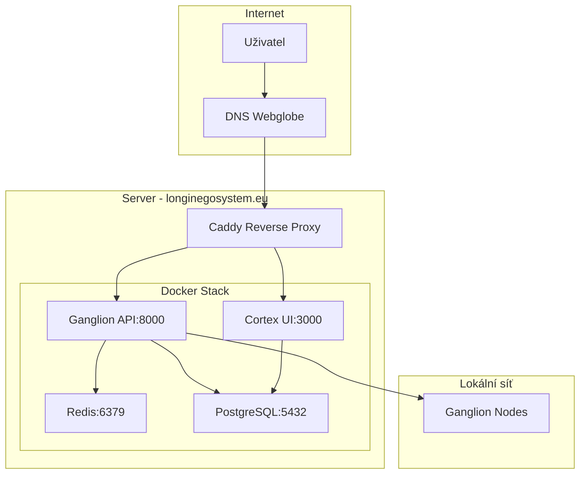

# Implementační plán hosting serveru pro Longin EGO System

## 1. Přehled systému

Longin EGO System je distribuovaný kognitivní operační systém sestávající z:
- **Nexus Kernel** (Python) - centrální orchestrátor
- **Cortex UI** (Next.js) - uživatelské rozhraní
- **Ganglion API** - distribuované výpočetní uzly
- **Redis** - message broker a hot memory
- **PostgreSQL** - persistentní úložiště s pgvector
- **Caddy** - reverse proxy s automatickým HTTPS

## 2. Technické požadavky

### 2.1 Hardware
- **CPU**: Minimálně 4 jádra (8 doporučeno)
- **RAM**: 32GB (minimum), 64GB (doporučeno)
- **GPU**: NVIDIA RTX 3060 (12GB VRAM) nebo lepší
- **Storage**: 100GB SSD (minimum), 500GB NVMe (doporučeno)
- **Síť**: 100Mbps (minimum), 1Gbps (doporučeno)

### 2.2 Software
- **OS**: Ubuntu 22.04 LTS / Debian 12 / Windows Server 2022
- **Docker**: 24.0+ s Docker Compose
- **Python**: 3.12+ (pro lokální testing)
- **Node.js**: 20+ (pro lokální testing)
- **Git**: 2.30+ (pro deployment)

### 2.3 Síťové požadavky
- **Porty**: 80, 443 (web), 5432 (PostgreSQL), 6379 (Redis), 8000 (API), 3000 (UI)
- **Doména**: www.longinegosystem.eu (registrovaná u Webglobe)
- **SSL**: Automatické přes Let's Encrypt (Caddy)

## 3. Architektonické schéma



## 4. Krok-za-krokem implementace

### Krok 1: Příprava serveru

**1.1 Instalace závislostí**
```bash
# Ubuntu/Debian
sudo apt update && sudo apt upgrade -y
sudo apt install -y curl git docker.io docker-compose-v2 nginx

# Přidání uživatele do docker skupiny
sudo usermod -aG docker $USER
newgrp docker
```

**1.2 Konfigurace firewallu**
```bash
sudo ufw allow 22/tcp
sudo ufw allow 80/tcp
sudo ufw allow 443/tcp
sudo ufw enable
```

**1.3 Nastavení hostname**
```bash
sudo hostnamectl set-hostname longinegosystem
sudo nano /etc/hosts
# Přidat: 127.0.1.1 longinegosystem.eu longinegosystem
```

### Krok 2: DNS konfigurace (Webglobe)

**2.1 Nastavení A záznamů v Webglobe admin panelu:**
```
Type: A
Name: @ (root)
Value: [SERVER_IP]
TTL: 3600

Type: A
Name: www
Value: [SERVER_IP]
TTL: 3600
```

**2.2 Ověření DNS propagace:**
```bash
dig longinegosystem.eu
nslookup longinegosystem.eu
dig www.longinegosystem.eu
```

### Krok 3: SSL certifikáty a Caddy

**3.1 Instalace Caddy**
```bash
sudo apt install -y debian-keyring debian-archive-keyring apt-transport-https
curl -1sLf 'https://dl.cloudsmith.io/public/caddy/stable/gpg.key' | sudo gpg --dearmor -o /usr/share/keyrings/caddy-stable-archive-keyring.gpg
curl -1sLf 'https://dl.cloudsmith.io/public/caddy/stable/debian.deb.txt' | sudo tee /etc/apt/sources.list.d/caddy-stable.list
sudo apt update
sudo apt install caddy
```

**3.2 Konfigurace Caddyfile**
```bash
sudo mkdir -p /etc/caddy
sudo nano /etc/caddy/Caddyfile
```

Obsah Caddyfile:
```
longinegosystem.eu {
    redir https://www.longinegosystem.eu{uri}
}

www.longinegosystem.eu {
    reverse_proxy /v1/* localhost:8000
    reverse_proxy localhost:3000
}
```

**3.3 Restart Caddy služby**
```bash
sudo systemctl restart caddy
sudo systemctl enable caddy
```

### Krok 4: Docker konfigurace

**4.1 Vytvoření Docker sítě**
```bash
docker network create longin-net
```

**4.2 Volumes pro persistentní data**
```bash
docker volume create redis-data
docker volume create postgres-data
docker volume create caddy-data
```

**4.3 Environment variables**
```bash
# Vytvoření .env souboru
nano .env.prod
```

Obsah .env.prod:
```env
# Database
POSTGRES_USER=longin
POSTGRES_PASSWORD=[GENERATE_STRONG_PASSWORD]
POSTGRES_DB=longin_ego

# Redis
REDIS_URL=redis://redis:6379/0

# Application
LONGIN_ENV=prod
NODE_ENV=production

# Security
JWT_SECRET=[GENERATE_STRONG_SECRET]
API_KEY=[GENERATE_API_KEY]
```

### Krok 5: Deployment aplikace

**5.1 Klonování repozitáře**
```bash
cd /opt
git clone [REPOSITORY_URL] longin-ego
cd longin-ego
```

**5.2 Build Docker images**
```bash
docker compose -f docker-compose.release.yml build --no-cache
```

**5.3 Spuštění služeb**
```bash
docker compose -f docker-compose.release.yml up -d
```

**5.4 Ověření běžících služeb**
```bash
docker compose -f docker-compose.release.yml ps
docker compose -f docker-compose.release.yml logs --tail=100 -f
```

### Krok 6: Inicializace databáze

**6.1 Spuštění migrací**
```bash
docker exec -it longin-ego-ganglion-api-1 python -m memory.postgres.migrate
```

**6.2 Seedování dat (volitelné)**
```bash
docker exec -it longin-ego-ganglion-api-1 psql -h postgres -U longin -d longin_ego -f /app/seeds/prod.sql
```

**6.3 Ověření databáze**
```bash
docker exec -it longin-ego-postgres-1 psql -U longin -d longin_ego -c "\dt"
```

### Krok 7: Health checks a monitoring

**7.1 Testování API endpointů**
```bash
curl -f http://localhost:8000/v1/health
curl -f http://localhost:8000/v1/ready
curl -f http://localhost:3000
```

**7.2 Testování přes doménu**
```bash
curl -f https://www.longinegosystem.eu/v1/health
curl -f https://www.longinegosystem.eu
```

**7.3 SSL certifikát kontrola**
```bash
curl -vI https://www.longinegosystem.eu | grep -i ssl
openssl s_client -connect www.longinegosystem.eu:443 -servername www.longinegosystem.eu
```

## 5. Monitorovací a zálohovací strategie

### 5.1 Monitoring

**Docker container monitoring:**
```bash
# Instalace monitoring toolů
docker run -d --name=netdata \
  --pid=host \
  --network=longin-net \
  -v netdataconfig:/etc/netdata \
  -v netdatalib:/var/lib/netdata \
  -v netdatacache:/var/cache/netdata \
  -v /etc/passwd:/host/etc/passwd:ro \
  -v /etc/group:/host/etc/group:ro \
  -v /proc:/host/proc:ro \
  -v /sys:/host/sys:ro \
  -v /etc/os-release:/host/etc/os-release:ro \
  -p 19999:19999 \
  --restart unless-stopped \
  netdata/netdata
```

**Log aggregation:**
```bash
# Instalace ELK stack (volitelné)
docker run -d --name=elasticsearch -p 9200:9200 -e "discovery.type=single-node" elasticsearch:8.11.0
docker run -d --name=kibana -p 5601:5601 --link elasticsearch kibana:8.11.0
```

### 5.2 Zálohování

**Databázové zálohy:**
```bash
#!/bin/bash
# backup.sh
DATE=$(date +%Y%m%d_%H%M%S)
BACKUP_DIR="/backup/postgres"
mkdir -p $BACKUP_DIR

# PostgreSQL záloha
docker exec longin-ego-postgres-1 pg_dump -U longin longin_ego > $BACKUP_DIR/postgres_$DATE.sql

# Redis záloha
docker exec longin-ego-redis-1 redis-cli SAVE
docker cp longin-ego-redis-1:/data/dump.rdb $BACKUP_DIR/redis_$DATE.rdb

# Komprese a rotace
tar -czf $BACKUP_DIR/backup_$DATE.tar.gz $BACKUP_DIR/*_$DATE.*
find $BACKUP_DIR -name "*.tar.gz" -mtime +7 -delete
```

**Automatizace záloh:**
```bash
# Přidání do crontab
crontab -e
# 0 2 * * * /opt/longin-ego/scripts/backup.sh
```

## 6. Bezpečnostní checklist

### 6.1 Zabezpečení serveru
- [ ] SSH pouze s klíči (zakázat password auth)
- [ ] Fail2ban nainstalován a aktivní
- [ ] Automatické aktualizace povoleny
- [ ] Firewall správně nakonfigurován
- [ ] Monitoring logů aktivní

### 6.2 Aplikační bezpečnost
- [ ] Všechny hesla změněny z defaultních
- [ ] API klíče generovány a uloženy v .env
- [ ] SSL certifikáty automaticky obnovovány
- [ ] Docker images aktualizovány
- [ ] Secret management implementován

### 6.3 Kontrola Docker bezpečnosti
```bash
# Kontrola zranitelností
docker run --rm -v /var/run/docker.sock:/var/run/docker.sock \
  -v /tmp:/tmp aquasec/trivy:latest image longin-ego/ganglion:latest

docker run --rm -v /var/run/docker.sock:/var/run/docker.sock \
  -v /tmp:/tmp aquasec/trivy:latest image longin-ego/cortex:latest
```

## 7. Řešení běžných problémů

### 7.1 Container nejde spustit
```bash
# Kontrola logů
docker compose logs [service-name]

# Kontrola portů
sudo netstat -tulpn | grep :[PORT]

# Restart služeb
docker compose down
docker compose up -d
```

### 7.2 Databázové připojení selhává
```bash
# Test připojení
docker exec -it [container] nc -zv postgres 5432

# Kontrola credentials
docker exec -it [container] env | grep POSTGRES
```

### 7.3 SSL certifikát problémy
```bash
# Restart Caddy
sudo systemctl restart caddy

# Kontrola certifikátů
sudo caddy validate --config /etc/caddy/Caddyfile
```

### 7.4 Výkonnostní optimalizace
```bash
# Kontrola využití zdrojů
docker stats

# Optimalizace PostgreSQL
docker exec -it longin-ego-postgres-1 \
  psql -U longin -d longin_ego -c "SELECT pg_size_pretty(pg_database_size('longin_ego'));"

# Redis optimalizace
docker exec -it longin-ego-redis-1 redis-cli INFO memory
```

## 8. Testovací procedury

### 8.1 Unit testy
```bash
docker exec -it longin-ego-ganglion-api-1 python -m pytest tests/ -v
```

### 8.2 Integrační testy
```bash
# Test API endpointů
curl -X POST http://localhost:8000/v1/spawn \
  -H "Content-Type: application/json" \
  -d '{"command": "print(\"Hello World\")", "sandbox_mode": true}'
```

### 8.3 Load testing
```bash
# Instalace Apache Bench
sudo apt install apache2-utils

# Test UI
ab -n 1000 -c 10 https://www.longinegosystem.eu/

# Test API
ab -n 1000 -c 10 -T 'application/json' \
  -p test-data.json https://www.longinegosystem.eu/v1/health
```

## 9. Dokumentace a maintenance

### 9.1 Dokumentace
- [ ] README aktualizován pro produkční prostředí
- [ ] API dokumentace vygenerována
- [ ] Troubleshooting guide vytvořen
- [ ] Backup recovery procedury otestovány

### 9.2 Maintenance schedule
- **Denně**: Kontrola logů a health checks
- **Týdně**: Aktualizace Docker images
- **Měsíčně**: Bezpečnostní audit a zálohy
- **Čtvrtletně**: Performance review a optimalizace

### 9.3 Kontakty a eskalace
- **Primární kontakt**: [YOUR_EMAIL]
- **Backup kontakt**: [BACKUP_EMAIL]
- **Emergency procedury**: Dokumentovány v /docs/emergency.md

## 10. Validace úspěšnosti

### 10.1 Kontrolní body
- [ ] Všechny služby běží (docker ps)
- [ ] Health checks procházejí
- [ ] SSL certifikáty jsou platné
- [ ] Doména správně směruje
- [ ] Databáze je přístupná
- [ ] Zálohování funguje
- [ ] Monitoring je aktivní

### 10.2 Performance metriky
- **Response time**: < 200ms pro API
- **Uptime**: > 99.9%
- **Memory usage**: < 80%
- **Disk usage**: < 85%
- **Error rate**: < 1%

### 10.3 Dokončení
Po úspěšném dokončení všech kroků bude Longin EGO System plně funkční a dostupný na:
- **Hlavní URL**: https://www.longinegosystem.eu
- **API endpoint**: https://www.longinegosystem.eu/v1/
- **Health check**: https://www.longinegosystem.eu/v1/health

Systém bude připraven pro autonomní kognitivní operace s plnou podporou ERTDSD smyčky a distribuované orchestrace.