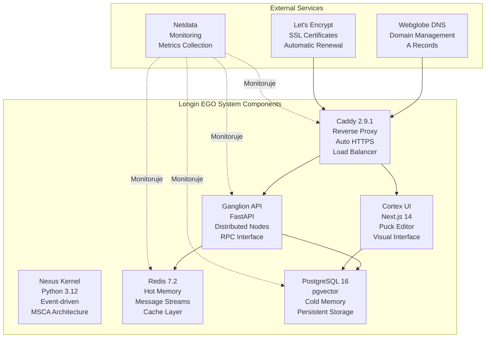

# Kompletní přehled Longin EGO System - Hosting & Deployment

## 1. Struktura dokumentace

Tento dokument obsahuje kompletní přehled všech komponent systému Longin EGO pro účely hostingu a produkčního nasazení:

### Vytvořené dokumenty:
1. **[implementacni-plan-hosting-serveru.md](implementacni-plan-hosting-serveru.md)** - Detailní krok-za-krokem implementační plán
2. **[technicka-architektura-hostingu.md](technicka-architektura-hostingu.md)** - Technická architektura infrastruktury
3. **[bezpecnostni-monitorovaci-protokol.md](bezpecnostni-monitorovaci-protokol.md)** - Bezpečnostní a monitorovací protokol
4. **[kompletni-prehled-systemu.md](kompletni-prehled-systemu.md)** - Tento souhrnný dokument

## 2. Přehled systémových komponent

### 2.1 Hlavní aplikační komponenty



### 2.2 Technologický stack

**Backend technologie:**
- **Runtime**: Python 3.12 slim
- **Framework**: FastAPI 0.110+ with async support
- **Orchestration**: LangGraph for ERTDSD workflows
- **Message Broker**: Redis Streams for event-driven architecture
- **Database**: PostgreSQL 16 with pgvector for vector operations
- **Security**: Sibling containers, AST scanning, input validation

**Frontend technologie:**
- **Framework**: Next.js 14 with App Router
- **UI Editor**: Puck 0.15.0 for visual editing
- **Styling**: Tailwind CSS (implied from Next.js setup)
- **State Management**: Server components with client hydration
- **Build Tool**: Vite integration via Next.js

**Infrastrukturní technologie:**
- **Containerization**: Docker 24.0+ with Docker Compose
- **Reverse Proxy**: Caddy 2.9.1 with automatic HTTPS
- **Monitoring**: Netdata for real-time system metrics
- **SSL/TLS**: Let's Encrypt with automatic renewal
- **DNS**: Webglobe for domain management

## 3. Architektonické vzory

### 3.1 MSCA (Module-Sentinel-Connector-Adapter)
- **Sentinel**: Ultra-lightweight processes for intent detection
- **Module**: Heavy-duty components with lazy loading
- **Connector**: Communication layer with circuit breaking
- **Adapter**: Data transformation and self-healing

### 3.2 ERTDSD (EGO Ruled Test-Driven Self-Development)
- **Meeting Phase**: Requirement gathering and DoD definition
- **Architect Phase**: Test generation (Red phase)
- **Grind Phase**: Autonomous development loop
- **Presentation Phase**: Result presentation and approval

### 3.3 Bikamerální paměťový systém
- **Hot Memory (Redis)**: Active context, TTL 24h
- **Warm Memory (PostgreSQL)**: Semantic knowledge for RAG
- **Cold Memory (Archive)**: Long-term storage and LoRA fine-tuning

## 4. Bezpečnostní komponenty

### 4.1 Vícevrstvé zabezpečení
- **Perimeter**: Firewall (UFW), rate limiting, SSL/TLS
- **Application**: Input validation, AST scanning, security headers
- **Container**: Sibling isolation, resource limits, capability dropping
- **Data**: Encryption at rest and in transit, audit logging

### 4.2 Kritické bezpečnostní mechanismy
- **Sibling Containers**: Code execution in isolated Docker containers
- **AST Security Scanner**: Static analysis for forbidden imports
- **Identity Firewall**: Protection of soul.md and system identity
- **Emergency Kill Switch**: Immediate system shutdown capability

### 4.3 Compliance a audit
- **Audit Logging**: All security events and user actions
- **Compliance Reporting**: Monthly security reports
- **Vulnerability Scanning**: Regular container scanning with Trivy
- **Incident Response**: Defined procedures and escalation paths

## 5. Monitorovací a metriky

### 5.1 Systémové metriky
- **CPU Usage**: < 80% normal, > 95% critical
- **Memory Usage**: < 85% normal, > 95% critical
- **Disk Usage**: < 80% normal, > 90% critical
- **Network**: Bandwidth utilization and latency

### 5.2 Aplikační metriky
- **Request Rate**: HTTP requests per second
- **Response Time**: < 200ms target, < 2s maximum
- **Error Rate**: < 1% success rate
- **Active Tasks**: Number of concurrent ERTDSD workflows

### 5.3 Business metriky
- **Task Completion**: Success rate of autonomous development
- **User Engagement**: UI interaction metrics
- **System Availability**: > 99.9% uptime target
- **Resource Efficiency**: GPU/CPU utilization optimization

## 6. Infrastrukturní požadavky

### 6.1 Hardware specifikace (Doporučeno)
```yaml
CPU: AMD Ryzen 7 5800X / Intel i7-12700K (8+ jader)
RAM: 64GB DDR4-3200 (32GB minimum)
GPU: NVIDIA RTX 3060 12GB / RTX 4070 12GB
Storage: 1TB NVMe SSD (500GB minimum)
Network: 1Gbps symmetric (100Mbps minimum)
Power: 750W PSU, UPS backup
Cooling: Adequate for 24/7 operation
```

### 6.2 Síťové požadavky
- **Veřejné porty**: 80, 443 (web), 22 (SSH - omezeno)
- **Interní porty**: 5432 (PostgreSQL), 6379 (Redis), 8000 (API), 3000 (UI)
- **DNS**: A záznamy pro longinegosystem.eu a www.longinegosystem.eu
- **SSL**: Automatické certifikáty přes Let's Encrypt

### 6.3 Software požadavky
- **OS**: Ubuntu 22.04 LTS / Debian 12 / Windows Server 2022
- **Docker**: 24.0+ s Docker Compose v2
- **Monitoring**: Netdata, optional ELK stack
- **Backup**: Cron, GPG encryption, cloud storage

## 7. Deployment proces

### 7.1 Příprava prostředí
1. **Server setup**: OS instalace, aktualizace, firewall
2. **Docker instalace**: Container runtime a Compose
3. **DNS konfigurace**: Webglobe A záznamy
4. **SSL příprava**: Caddy instalace a konfigurace

### 7.2 Aplikační deployment
1. **Kód deployment**: Git clone a build proces
2. **Database setup**: Migrace a seed data
3. **Container orchestration**: Docker Compose startup
4. **Health verification**: Kontrola všech služeb

### 7.3 Validace a testing
1. **Smoke tests**: Základní funkčnost
2. **Load testing**: Výkonnostní testy
3. **Security scanning**: Zranitelnosti a compliance
4. **Monitoring setup**: Metriky a alerting

## 8. Zálohování a obnova

### 8.1 Backup strategie
- **Frekvence**: Denně plné, hodinově inkrementální
- **Retence**: 7 dní plné, 30 dní inkrementální
- **Šifrování**: GPG pro všechny zálohy
- **Storage**: Lokální + cloud (S3-kompatibilní)

### 8.2 Komponenty záloh
- **PostgreSQL**: Plné databázové dumpy
- **Redis**: RDB snapshoty
- **Application data**: Konfigurace a uploads
- **System config**: Server konfigurace

### 8.3 Obnovení
- **RTO (Recovery Time Objective)**: 1 hodina
- **RPO (Recovery Point Objective)**: 1 hodina
- **Proces**: Automatizované skripty s manuálním oversight
- **Testing**: Týdenní test obnovení

## 9. Řešení problémů

### 9.1 Běžné problémy
- **Container startup failure**: Log kontrola, resource limits
- **Database connection issues**: Network, credentials, health checks
- **SSL certificate problems**: Caddy logs, DNS propagation
- **Performance degradation**: Resource monitoring, optimization

### 9.2 Diagnostické nástroje
- **Docker logs**: `docker compose logs [service]`
- **System metrics**: Netdata dashboard (port 19999)
- **Health checks**: `/v1/health` a `/v1/ready` endpointy
- **Resource usage**: `docker stats` a `htop`

### 9.3 Esalační procedury
- **Level 1**: Automatické alerty a self-healing
- **Level 2**: Manuální intervence podle runbook
- **Level 3**: Vývojářský tým a architekt
- **Level 4**: Externí podpora a vendor escalation

## 10. Dokumentace a údržba

### 10.1 Dokumentace
- **Technická**: Architektura, API reference, konfigurace
- **Operační**: Runbooky, procedury, troubleshooting
- **Uživatelská**: UI návody, best practices, FAQ
- **Bezpečnostní**: Politiky, incident response, compliance

### 10.2 Maintenance schedule
- **Denně**: Health checks, log review, backup verification
- **Týdně**: Security updates, performance review
- **Měsíčně**: Compliance audit, capacity planning
- **Čtvrtletně**: Architektura review, disaster recovery test

### 10.3 Kontakty a eskalace
- **Primární administrátor**: [Kontaktní údaje]
- **Backup kontakt**: [Kontaktní údaje]
- **Vývojářský tým**: [Kontaktní údaje]
- **Emergency hotline**: [Telefonní číslo]

## 11. Závěr a další kroky

Tato dokumentace poskytuje kompletní přehled pro úspěšné nasazení Longin EGO System v produkčním prostředí. Systém je navržen pro:

- **24/7 provoz** s minimální downtime
- **Vysokou bezpečnost** s vícevrstvým zabezpečením
- **Škálovatelnost** pro rostoucí workload
- **Autonomní vývoj** pomocí ERTDSD metodiky
- **Distribuované výpočty** přes Ganglion uzly

Pro úspěšnou implementaci postupujte podle kroků v [implementacni-plan-hosting-serveru.md](implementacni-plan-hosting-serveru.md) a použijte technickou architekturu z [technicka-architektura-hostingu.md](technicka-architektura-hostingu.md).

**Důležité upozornění**: Před produkčním nasazením proveďte důkladné testování v staging prostředí a zajistěte adekvátní zálohovací strategii.

---

**Dokumentace vytvořena pro**: Longin EGO System v8.0
**Verze**: 1.0
**Datum vytvoření**: 2025-02-25
**Autor**: Document Agent
**Status**: Ready for Implementation