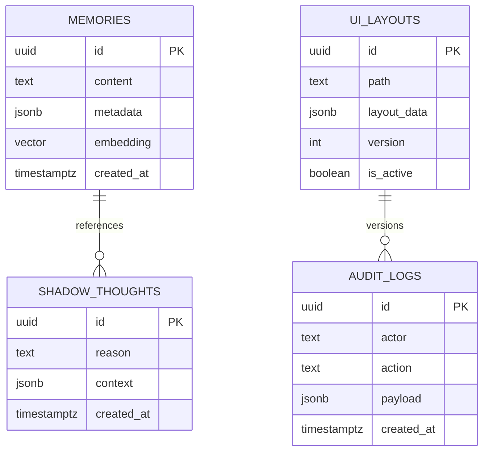

## 1.Architecture design

```mermaid
graph TD
  "User Browser" --> "React/Next.js Cortex UI"
  "React/Next.js Cortex UI" --> "HTTP API (FastAPI)"
  "HTTP API (FastAPI)" --> "Redis Streams"
  "HTTP API (FastAPI)" --> "PostgreSQL (pgvector)"
  "Kernel Runtime (Python)" --> "Redis Streams"
  "Kernel Runtime (Python)" --> "PostgreSQL (pgvector)"
  "Kernel Runtime (Python)" --> "Docker Daemon (Sibling Containers)"
  "Kernel Runtime (Python)" --> "mDNS Discovery (Zeroconf)"

  subgraph "Frontend Layer"
    "React/Next.js Cortex UI"
  end

  subgraph "Backend Layer"
    "HTTP API (FastAPI)"
    "Kernel Runtime (Python)"
  end

  subgraph "Data Layer"
    "Redis Streams"
    "PostgreSQL (pgvector)"
  end

  subgraph "External/Host Services"
    "Docker Daemon (Sibling Containers)"
    "mDNS Discovery (Zeroconf)"
  end
```

## 2.Technology Description
- Frontend: React@18 + Next.js@14 + tailwindcss@3
- Initialization Tool: create-next-app
- Backend: Python 3.12 + FastAPI + LangGraph
- Database: PostgreSQL (pgvector) + Redis Streams

## 3.Route definitions
| Route | Purpose |
|-------|---------|
| / | Dashboard (Cortex UI): levý panel modulů, centrální chat, pravý ovládací panel |
| /login | Přihlášení uživatele, volba identity (soul.md profil) |
| /modules/[id] | Detail modulu: stav, parametry, logy, akce |
| /chat | Oddělené okno chatu, když UI modulu chat neobsahuje |
| /api/puck | Persistuje UI layout změny (Puck) |

## 4.API definitions (If it includes backend services)

### 4.1 Core API

System metrics
```
GET /api/metrics
```

Response:
| Param Name| Param Type  | Description |
|-----------|-------------|-------------|
| cpu_usage | number      | CPU využití (%) |
| ram_usage | number      | RAM využití (MB) |
| gpu_temp  | number      | Teplota GPU (°C) |
| vram_free | number      | Volná VRAM (MB) |

Inbox publish (event bus)
```
POST /api/inbox/publish
```

Request:
| Param Name| Param Type  | isRequired  | Description |
|-----------|-------------|-------------|-------------|
| headers   | object      | true        | Hlavičky se semantickými tagy (🧠, 🛠️, ⚡, 🔥) |
| payload   | object      | true        | Obsah zprávy |

Response:
| Param Name| Param Type  | Description |
|-----------|-------------|-------------|
| status    | boolean     | Stav přijetí |

Module execute
```
POST /api/modules/{moduleId}/execute
```

Request:
| Param Name| Param Type  | isRequired  | Description |
|-----------|-------------|-------------|-------------|
| params    | object      | false       | Parametry exekuce |

Response:
| Param Name| Param Type  | Description |
|-----------|-------------|-------------|
| job_id    | string      | ID úlohy |
| status    | string      | queued/running/done/error |

Ganglion discovery
```
GET /api/network/resources
```

Response:
| Param Name| Param Type  | Description |
|-----------|-------------|-------------|
| nodes     | array       | Seznam uzlů (hostname, gpu_model, vram_free_mb) |

## 5.Server architecture diagram (If it includes backend services)

```mermaid
graph TD
  "Client / Frontend" --> "Controller Layer (FastAPI)"
  "Controller Layer (FastAPI)" --> "Service Layer (Kernel Orchestration)"
  "Service Layer (Kernel Orchestration)" --> "Repository Layer (Redis/Postgres Clients)"
  "Repository Layer (Redis/Postgres Clients)" --> "(Redis Streams / PostgreSQL)"
  "Service Layer (Kernel Orchestration)" --> "Sibling Sandbox Runner (Docker)"

  subgraph "Server"
    "Controller Layer (FastAPI)"
    "Service Layer (Kernel Orchestration)"
    "Repository Layer (Redis/Postgres Clients)"
    "Sibling Sandbox Runner (Docker)"
  end
```

## 6.Data model(if applicable)

### 6.1 Data model definition


### 6.2 Data Definition Language
Memories (memories)
```
CREATE TABLE memories (
  id UUID PRIMARY KEY DEFAULT gen_random_uuid(),
  content TEXT NOT NULL,
  embedding VECTOR(1536),
  metadata JSONB,
  created_at TIMESTAMPTZ DEFAULT NOW()
);
CREATE INDEX idx_memories_embedding ON memories USING hnsw (embedding vector_cosine_ops);
CREATE INDEX idx_memories_fts ON memories USING GIN (to_tsvector('english', content));
```

Shadow Thoughts (shadow_thoughts)
```
CREATE TABLE shadow_thoughts (
  id UUID PRIMARY KEY DEFAULT gen_random_uuid(),
  reason TEXT NOT NULL,
  context JSONB,
  created_at TIMESTAMPTZ DEFAULT NOW()
);
```

UI Layouts (ui_layouts)
```
CREATE TABLE ui_layouts (
  id UUID PRIMARY KEY DEFAULT gen_random_uuid(),
  path TEXT NOT NULL,
  layout_data JSONB NOT NULL,
  version INT DEFAULT 1,
  is_active BOOLEAN DEFAULT TRUE
);
```

Audit Logs (audit_logs)
```
CREATE TABLE audit_logs (
  id UUID PRIMARY KEY DEFAULT gen_random_uuid(),
  actor TEXT NOT NULL,
  action TEXT NOT NULL,
  payload JSONB,
  created_at TIMESTAMPTZ DEFAULT NOW()
);
CREATE INDEX idx_audit_logs_actor ON audit_logs(actor);
CREATE INDEX idx_audit_logs_created_at ON audit_logs(created_at DESC);
```